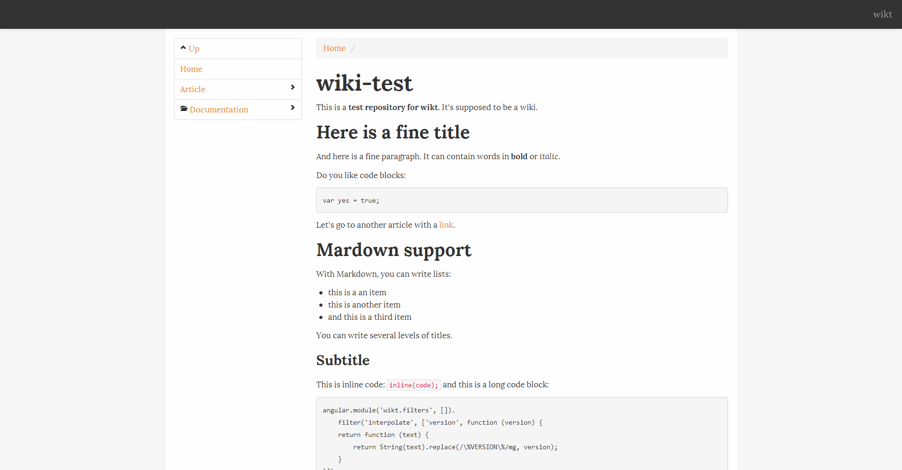

# wikt

The wicked git wiki

Work in progress, please come back later.



## Installation

Requires:

- Node.js > 0.8
- cmake
- Python

Install Node libraries:

```bash
cd src/
npm install
```

If you are using Vagrant on Windows, you will need to run `npm install --no-bin-links` instead.

Clone a wiki repository inside `test/`, for example:

```bash
cd test
git clone git://github.com/wikt/wiki-test.git
```

## JS Git libraries comparison

Full JS implementations:

- [nodegit](https://github.com/tbranyen/nodegit) (need python and cmake installed on the server)
- [Gitteh](https://github.com/libgit2/node-gitteh) (need cmake installed on the server)

nodegit has slightly better doc and more commits.

Wrappers around Git CLI:

- [Gift](https://github.com/sentientwaffle/gift)
- [node-git](https://github.com/creationix/node-git/) (doesn't work on Node 0.8)
- [node-git](https://github.com/christkv/node-git/) (half JS implementation, half CLI wrapper)
